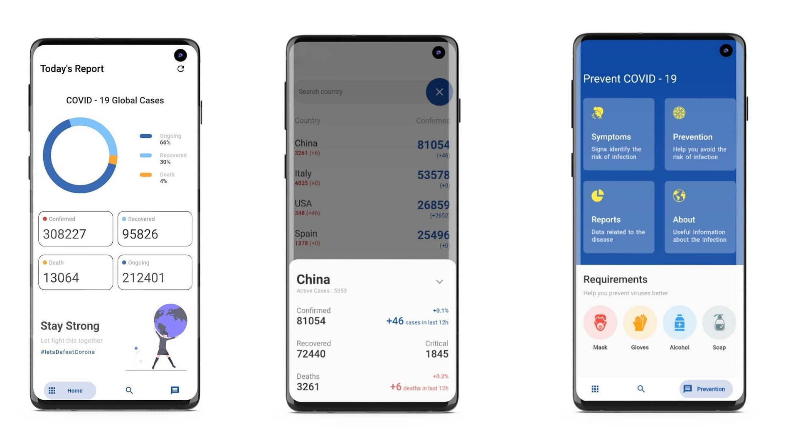

# Go Corona
 

A Flutter application to track the ongoing status of the COVID-19 cases. 

The data we provide is collected from [World Health Organization (WHO)](https://www.who.int/), the US [Centers for Disease Control and Prevention (CDC)](https://www.cdc.gov/), the [Chinese Centre for Disease Control and Prevention (ECDC)](http://www.chinacdc.cn/en/), [China’s National Health Commission](http://en.nhc.gov.cn/), and Chinese website DXY which provides regional case estimates faster than the national level reporting organizations.

The [API]( https://coronavirus-19-api.herokuapp.com/ ) was used to provide the data. The [www.cdc.gov](https://www.cdc.gov/) was used to provide the guides.

Features :

- [x] Country wise reports
- [x] Continent wise reports
- [x] Prevention, Precautions and Symptoms
- [ ] Favorite Countries

# Screenshots

# Plugins

| Package Name                                                | Usage                  |
| ----------------------------------------------------------- | ---------------------- |
| [Flutter Bloc](https://pub.dev/packages/flutter_bloc)       | State Management       |
| [Bottom Navy Bar](https://pub.dev/packages/bottom_navy_bar) | Bottom Navigation Bar  |
| [Pie Chart](https://pub.dev/packages/pie_chart)             | Representation of data |

# License

[Apache 2.0](https://github.com/r0hnx/GoCorona/blob/master/LICENSE)

# Getting Started

A few resources to get you started if this is your first Flutter project:

- [Lab: Write your first Flutter app](https://flutter.dev/docs/get-started/codelab)
- [Cookbook: Useful Flutter samples](https://flutter.dev/docs/cookbook)

For help getting started with Flutter, view our
[online documentation](https://flutter.dev/docs), which offers tutorials,
samples, guidance on mobile development, and a full API reference.
